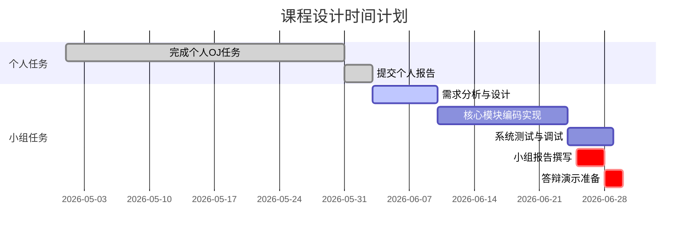

# 执行摘要（Executive Summary）

本报告综合分析了提供的《数据结构课程设计》相关文件，从中提炼出小组课程设计的目标、要求、交付物、时间安排、评分标准等信息，并据此形成面向学生的任务说明书。首先，总结了课程设计的总体目标与学习成果，包括算法设计能力、编程规范、团队合作与创新意识等；然后列出并比较了所有**必交与可选交付物**的清单（格式、篇幅、引用规范等）；接着制定了项目**时间表与里程碑**（包括个人任务与小组任务的阶段），并通过甘特图直观展示时间线；接下来建议了组内分工与角色定义（以**4人组**为例，并指出3–5人组的调整）；制定了**评分细则与权重分配**（总分100分，包括程序设计与实现、实验报告、答辩演示三个部分）；随后提出了**合作与沟通工具**推荐，以及对**学术诚信与查重**、**迟交补交**、**评审反馈**、**答疑安排**等方面的说明。在需要的地方标注了假设和文件未指定事项。本报告以清晰的分析结构和表格形式呈现所需信息，并附有最终可直接发给组员的任务说明书文本，方便复制粘贴使用。  

## 作业总体目标与学习成果

- **培养算法设计与编程能力**：通过设计与实现“上海地铁路径规划与运营管理系统”，要求学生深入理解图及路径算法（如Dijkstra最短路径、换乘最少路径等）的原理与实现。  
- **锻炼数据结构应用**：要求选用并合理设计数据结构（如邻接表、结构体、队列等）来构建地铁网络模型，并在**地铁图建模模块**中完成网络导入与存储。  
- **实施系统功能并测试**：实现基础功能（站点与线路信息管理、路径查询、运营管理等）及拓展功能（如受影响区域分析），并撰写测试文档验证功能正确性、稳定性和效率。  
- **培养团队协作与创新**：要求组员合理分工合作，按时高质量地完成任务。参考资料指出课程设计旨在增强创新意识、合作精神以及面向实际场景解决问题的能力。  
- **培养编程规范与文档能力**：代码需具有良好的可读性和注释规范，实验报告需结构完整、条理清晰，包括设计说明、示例、测试等内容。  
- **（假设）评估学习成果**：通过完成项目，可检验学生是否掌握了数据结构原理、算法设计、软件测试基本技能，以及对工程实践流程的理解。  

## 必交与可选交付物清单

| 交付物             | 是否必交 | 文件格式       | 页数/时长要求               | 引用格式及说明               |
| ------------------ | -------- | -------------- | --------------------------- | ---------------------------- |
| 小组课程设计报告   | 必交     | Word 文档（参照**小组报告模板**） | 建议约10–15页，含图表和附录；需附组员贡献度表 | 引用资料请在文中标注序号，附参考文献列表（参照课程指导书格式） |
| 个人设计报告       | 必交     | Word 文档      | 建议3–5页，针对个人负责模块的设计说明 | 同上                           |
| 源代码与可执行文件 | 必交     | 代码文件与可执行文件 | 完整、可编译运行；每人提交自己完成的代码 | 代码内需注释，引用他人代码须注明来源 |
| 测试文档（可选）   | 可选     | Word 或 PDF    | 包含测试用例设计、预期与实际结果（可参见示例文档） | 如引用公开数据或文献需注明来源  |
| AI交互记录（视情况）| 可选     | 文本（附报告末尾） | 使用AI编码助手的组员提交完整对话记录（问题、回复、思考过程）；未使用者可省略 | 对报告中的结果依据须注明引用 |
| 演示材料（可选）   | 可选     | 演示文稿 (PPT) | ~10–15页，展示主要功能与成果    | 图表引用与正文要求一致         |

- **说明**：所有文档请使用标准论文格式，包含目录、章节、图表（如有）、参考文献等。实验报告结构完整、书写规范，引用资料需注明来源。  
- **附件**：小组报告封面需含“组号、指导教师、组员名单与贡献度”信息（参见报告模板）；报告末尾可附交互记录和测试表格。  

## 时间表与里程碑

- **课程进度（参考）**：课程设计共10节课，安排如：第1节布置任务并分组；第2–6节完成个人任务；第7–9节开展小组任务；第10节验收与答辩。  
- **关键里程碑**：
  - **第1周**：组建团队（3–5人），选举组长，确定分工，提交组员名单与贡献度表。  
  - **第2–6周**：完成个人任务（OJ平台编程）并提交个人报告；组内交流进展。  
  - **第7周**：进行需求分析与系统设计，明确各功能模块。  
  - **第8–9周**：编码实现阶段；组内测试基本功能、算法与边界情况；撰写测试文档或在报告中列出测试表。  
  - **第10周**：准备最终演示与答辩；提交小组报告和源代码；进行系统演示并回答提问。  
- **时间线**（以2026年6月为目标完成时间，实际日期按教学日程调整）：

*备注：以上时间安排仅供参考（**假设**每周一课时）。具体截止日期请听从教师通知。*

## 组内分工建议与角色定义

- **组员人数**：3–5人（指导书要求）。以下以**4人组**示例分工，实际情况可增减成员。  
- **示例分工表（4人组）**：

| 成员   | 分工模块           | 技术要点与职责                               |
| ------ | ------------------ | ------------------------------------------- |
| 成员A  | 地铁图建模与导入   | 使用邻接表等结构存储网络，解析CSV数据（站点、线路、状态） |
| 成员B  | 路径算法实现       | 实现最短时间路径和最少换乘路径（Dijkstra、优先队列等） |
| 成员C  | 路径结果处理与输出 | 多路径生成、排序、去重；站点/线路状态过滤；输出展示 |
| 成员D  | 用户交互与管理     | 设计菜单界面；处理站点状态更新（CSV写入）；界面交互逻辑 |

- **说明**：以上为示例，可根据组员专长调整。如3人组可合并模块，5人组可拆分测试或文档编写。每位成员需明确职责，确保工作量均衡。组长负责整体进度和沟通协调。  

## 评分细则与权重分配（总分100分）

| 评分项目       | 内容说明                                     | 分值 |
| -------------- | -------------------------------------------- | ---- |
| 程序设计与实现 | 数据结构选择合理、算法正确高效、功能完整性、程序正确性、代码规范性（命名、注释） | 60   |
| 实验报告       | 报告结构完整规范、问题分析清晰、设计说明合理、测试结果充分、总结到位     | 30   |
| 答辩与演示     | 演示功能完整、操作熟练；答辩回答问题准确清晰           | 10   |

- **子细则**：  
  - 程序设计（60分）：数据结构设计（10分）、算法设计（10分）、功能完整性（15分）、程序正确性（15分）、代码规范（10分）。  
  - 实验报告（30分）：包括问题分析、数据结构与算法说明、系统实现说明、测试结果分析、总结与展望等，要求内容完整详实。  
  - 答辩与演示（10分）：系统演示全面且逻辑清晰（5分），回答问题准确有条理（5分）。  
- **说明**：评分细则参照课程指导书要求。完成度高、格式规范、逻辑清晰等可加分；代码运行失败或功能缺失会扣分。

## 合作与沟通工具建议

（文件中未指定，组内自行选择）常见推荐工具：  
- **版本控制与协作**：Git（如GitHub/Gitee）管理代码和版本。  
- **文档共享**：使用团队网盘（WPS云、OneDrive等）或在线协作文档共享报告和资源。  
- **即时通讯**：建立微信群/QQ群便于讨论问题、进度汇报。可使用在线会议工具（如腾讯会议）组织远程讨论。  
- **任务管理**：可用Trello、Notion或简单的组内待办清单跟踪任务进度。  
- **AI辅助**：使用通义灵码等AI编码工具时，请保存交互记录；组内可交流工具使用经验。

## 学术诚信与查重要求

- **学术规范**：请严格遵守学术诚信原则。所有提交内容必须原创，引用他人工作（论文、文档、代码段等）时须注明出处。严禁抄袭、作弊。  
- **查重说明**：文件中未给出具体查重阈值（**假设**按照学校要求，一般30%为参考限值）。提交前建议自行使用查重工具检查报告，确保重复率符合要求。  
- **合作说明**：个人任务需独立完成；小组任务可协同讨论和编程，但提交的代码和报告需真实反映每位成员贡献。

## 迟交与补交政策

- **未规定详细规则**：指导书中未明确迟交政策，请务必按时完成并提交。如因特殊原因需延期，应提前向教师说明，否则可能扣分（**假设**常见做法是每迟交1天扣总分的5%）。  
- **补交说明**：如因网络或其他技术问题无法准时上传，请尽快联系助教/老师补交文件。组长应督促成员避免出现因迟交影响组内进度的情况。

## 评审与反馈流程

- **组内评审**：建议定期组内检查代码和报告进度，相互演示功能并提出优化建议。组长可组织“阶段汇报”确保整体进度。  
- **教师评审**：课程最后一节课安排小组演示和答辩，由教师和助教现场评审并提问，根据表现给出即时反馈。  
- **修改完善**：答辩后教师可能给出修改建议，组内应根据反馈进一步完善报告和代码，并在规定时间内提交最终版本。  
- **成绩公布**：评分完成后公布成绩，如有异议请在规定时间内与教师沟通。贡献度表将作为个人成绩调整依据，请务必真实填写。

## 常见问题与答疑安排

- **提问渠道**：建议组建课程微信群/QQ群或使用雨课堂/在线讨论区，有问题可及时提问。  
- **答疑时间**：教师和助教在每周课程结束后或课外固定时间提供答疑服务，也可根据需要安排小组答疑会议。  
- **问题示例**：如“通义灵码如何使用？”，“数据文件格式如何加载？”，“环境配置问题？”，请先查阅指导书和说明书，如仍不解再提问。  

以上内容为综合整理的小组作业任务说明，希望各组成员认真阅读，明确分工，按时高质量完成项目。祝大家合作愉快，完成优质的课程设计！

## 附：任务说明书文本（可直接发给组员）

为便于组内成员沟通与执行，以下为经过整理的小组作业任务说明书正文，可复制粘贴并分发给全体组员：

**课程设计总目标**：完成“上海地铁路径规划与运营管理系统”的开发，通过使用合适的数据结构和算法（如图结构、Dijkstra等）来实现路径查询和运营管理功能；培养团队协作、创新和规范编程能力。

**任务要求**：  
- 组员共3–5人，明确分工。参照提供的分工示例或自行制定模块责任。  
- 按照时间节点完成个人任务和小组任务，提交所有必需材料。  

**交付物清单（均需提交）**：  
1. **个人设计报告**：Word 文档，3–5页，描述个人负责模块的设计思想和实现要点。  
2. **小组设计报告**：Word 文档，10–15页（详见报告模板），包含项目背景、需求分析、模块设计、示例截图、测试结果、总结等。封面需有组号、组长、成员名单及贡献度表。  
3. **源代码**：完整的可运行代码（程序文件和必要的数据文件），包括注释和说明。每位成员负责的代码请注明。  
4. **测试说明**：在报告中或单独提交测试案例表，说明测试目的、输入、预期输出、实际输出和结果。  
5. **（如使用AI助手）交互记录**：附在报告末尾，记录与AI工具的对话过程（提问、回复、思考过程）以供评分参考。

**时间安排与里程碑**：  
- 第1周：分组并提交组员名单与贡献度表，明确每人负责模块。  
- 第2–6周：完成个人OJ编程任务并提交个人报告；组内交流各自进展。  
- 第7周：进行需求分析和系统设计，确认各模块接口与数据流。  
- 第8–9周：联合编写小组代码，实现核心算法和功能；同时撰写测试用例并调试程序。  
- 第10周：准备系统演示并进行答辩；最终提交**小组报告**和源代码。

**组内分工示例（4人组）**：  
- 成员A：负责地铁网络数据建模（使用邻接表存储、CSV文件解析等）。  
- 成员B：负责实现路径查询算法（最短时间路径、最少换乘路径）。  
- 成员C：负责路径结果处理与输出（多路径生成、排序、去重）。  
- 成员D：负责用户交互和动态管理（菜单设计、站点状态更新）。  

请根据实际情况调整任务分配，确保每人工作量大致均衡。

**评分标准**（总分100）：  
- 程序设计与实现（60分）：包括数据结构选择合理性、算法正确性和复杂度、功能实现完整度、程序正确性，以及代码规范（命名、注释）。  
- 实验报告（30分）：要求分析透彻、结构规范，包括问题描述、设计说明、示例与测试、总结等内容。报告清晰完整将得到高分。  
- 答辩与演示（10分）：演示功能完整、熟练，能清晰回答提问，将获得满分。

**提交与答疑**：  
- 所有文件请在截止日期前上传至课程指定平台或邮箱，并抄送组长。  
- 如遇问题，及时在群内讨论或联系助教/老师。组长应协调各成员工作进度，确保无迟交。  
- 最后一次课将进行小组汇报，做好准备，并将贡献度表提交给老师。

**学术诚信**：请务必独立完成个人任务，合作完成小组任务。所有引用的思路或代码片段均需注明出处，避免抄袭。  

祝大家合作愉快，完成高质量的课程设计！